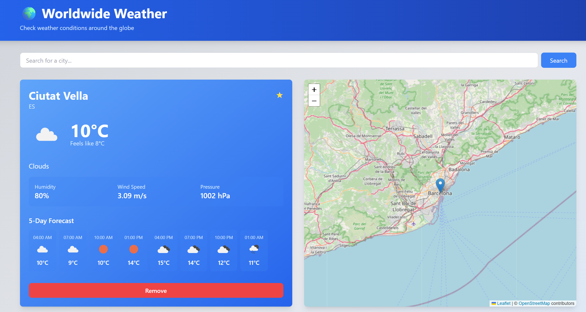

# 🌍 Worldwide Weather App

A modern, fully responsive weather application built with React that lets you check real-time weather conditions for any location worldwide. Features interactive maps, dynamic backgrounds, saved favorites, and beautiful UI with Tailwind CSS.

## 📸 Screenshot



*Weather app showing real-time weather data for Ciutat Vella, Barcelona with interactive map view*

## ✨ Features

- 🔍 **Global City Search** - Search for any city worldwide with autocomplete suggestions
- 📍 **Auto-Detection** - Automatically detects your current location (with permission)
- ⭐ **Favorite Locations** - Save your favorite cities for quick access
- 📊 **Current Weather** - View temperature, humidity, wind speed, and atmospheric pressure
- 📈 **5-Day Forecast** - Hourly weather predictions for the next 5 days
- 🗺️ **Interactive Map** - See location on an interactive Leaflet map powered by OpenStreetMap
- 🎨 **Dynamic Backgrounds** - Background changes based on current weather conditions
- 💾 **Local Storage** - Favorite locations are saved locally and persist between sessions
- 📱 **Fully Responsive** - Works perfectly on mobile, tablet, and desktop devices
- 🌡️ **Unit Toggle** - Display temperatures in Celsius or Fahrenheit

## 🛠️ Tech Stack

- **React 18** - UI library
- **Vite** - Fast build tool and development server
- **Tailwind CSS** - Utility-first CSS framework for styling
- **Leaflet** - Interactive maps
- **Axios** - HTTP client for API requests
- **OpenWeather API** - Real-time weather data
- **OpenStreetMap** - Map tiles (no API key needed)

## 📋 Prerequisites

Before you begin, ensure you have the following installed:
- **Node.js** 16+ and **npm** (get it from [nodejs.org](https://nodejs.org))
- A free API key from **OpenWeather** (get it from [openweathermap.org/api](https://openweathermap.org/api))

## 🚀 Getting Started

### 1. Clone the Repository

```bash
git clone https://github.com/Johnzki25/Weatherapppersonal.git
cd Weatherapppersonal
```

### 2. Install Dependencies

```bash
npm install
```

### 3. Set Up Environment Variables

Create a `.env.local` file in the project root:

```bash
# Copy the example file
cp .env.example .env.local

# Or create it manually and add:
VITE_WEATHER_API_KEY=your_openweather_api_key_here
```

**How to get your API key:**
1. Visit [https://openweathermap.org/api](https://openweathermap.org/api)
2. Sign up for a free account
3. Go to your API keys section
4. Copy your API key
5. Paste it into `.env.local`

### 4. Start the Development Server

```bash
npm run dev
```

The app will open automatically in your browser at `http://localhost:3000`

## 📖 How to Use

### 1. Search for a City

- Type a city name in the search bar
- Autocomplete suggestions will appear as you type
- Click on a suggestion to view weather for that city

### 2. View Weather Details

Once you search for a city, you'll see:
- **Weather Card** (left side): Current conditions, temperature, humidity, wind speed, and 5-day forecast
- **Interactive Map** (right side): Location pinned on the map with weather popup

### 3. Save Favorite Locations

- Click the **⭐ star icon** on the weather card to save a location
- Saved favorites appear in the **"Favorite Locations"** panel (bottom right)
- Click a favorite to quickly view its weather

### 4. Manage Locations

- **Viewing Locations Panel** - Shows all currently viewed locations
- Click a location to switch between them
- Click **"Remove"** on the weather card to delete a location

### 5. Interact with the Map

- The map shows the selected location with a marker
- Zoom in/out using the map controls
- Click the marker popup to see weather information

### 6. Dynamic Background

- The website background automatically changes based on the current weather:
  - ☀️ **Sunny** → Blue to yellow gradient
  - ☁️ **Cloudy** → Gray to blue gradient
  - 🌧️ **Rainy** → Dark gray to blue
  - ⛈️ **Thunderstorm** → Dark with yellow accents
  - ❄️ **Snow** → Light blue to white
  - 🌙 **Night** → Dark indigo gradients

## 🏗️ Project Structure

```
src/
├── components/          # React components
│   ├── Header.jsx       # App header
│   ├── SearchBar.jsx    # City search with autocomplete
│   ├── WeatherCard.jsx  # Weather display
│   ├── WeatherMap.jsx   # Interactive Leaflet map
│   ├── LocationList.jsx # Location management
│   └── FavoritesList.jsx # Favorite locations
├── services/
│   └── weatherAPI.js    # OpenWeather API integration
├── hooks/
│   └── useLocalStorage.js # Local storage management
├── utils/
│   └── backgroundUtils.js # Dynamic background logic
├── App.jsx              # Main app component
├── App.css              # App styles
└── index.css            # Global styles with Tailwind

public/
└── index.html           # HTML entry point

vite.config.js           # Vite configuration
tailwind.config.js       # Tailwind CSS config
postcss.config.js        # PostCSS config
package.json             # Dependencies
```

## 📦 Build for Production

```bash
npm run build
```

This creates an optimized build in the `dist/` folder ready for deployment.

## 🚢 Deploy to Vercel

### Option 1: Using Vercel CLI

```bash
npm install -g vercel
vercel
```

### Option 2: Connect to GitHub

1. Push your code to GitHub
2. Visit [vercel.com](https://vercel.com)
3. Click "New Project"
4. Select your GitHub repository
5. Add environment variable: `VITE_WEATHER_API_KEY` with your OpenWeather API key
6. Click "Deploy"

### Option 3: Deploy to Netlify

1. Push your code to GitHub
2. Visit [netlify.com](https://netlify.com)
3. Click "New site from Git"
4. Select your repository
5. Set build command: `npm run build`
6. Set publish directory: `dist`
7. Add environment variable: `VITE_WEATHER_API_KEY`
8. Click "Deploy site"

## 🔑 Environment Variables

| Variable | Description | Where to Get |
|----------|-------------|--------------|
| `VITE_WEATHER_API_KEY` | OpenWeather API key | [openweathermap.org/api](https://openweathermap.org/api) |

## 🌐 APIs Used

### OpenWeather API
- **Current Weather Endpoint** - Get real-time weather data
- **Forecast Endpoint** - Get 5-day forecast data
- **Geocoding Endpoint** - Search cities and get coordinates
- **Reverse Geocoding** - Get city name from coordinates
- **Free Plan** - 1000 calls/day (plenty for personal use!)

### OpenStreetMap
- **Free map tiles** - No API key required
- **Interactive maps** - Via Leaflet library

## 🛠️ Development

### Run Tests
```bash
npm run test
```

### Lint Code
```bash
npm run lint
```

### Format Code
```bash
npm run format
```

## 📱 Browser Support

- Chrome 90+
- Firefox 88+
- Safari 14+
- Edge 90+
- Mobile browsers (iOS Safari, Chrome Mobile)

## 🤝 Contributing

Contributions are welcome! To contribute:

1. Fork the repository
2. Create a feature branch (`git checkout -b feature/amazing-feature`)
3. Commit your changes (`git commit -m 'Add amazing feature'`)
4. Push to the branch (`git push origin feature/amazing-feature`)
5. Open a Pull Request

## 📄 License

This project is licensed under the MIT License - see the LICENSE file for details.

## 🙏 Acknowledgments

- [OpenWeather](https://openweathermap.org) - Weather data
- [OpenStreetMap](https://www.openstreetmap.org) - Map data
- [Leaflet](https://leafletjs.com) - Interactive maps
- [React](https://react.dev) - UI framework
- [Tailwind CSS](https://tailwindcss.com) - Styling
- [Vite](https://vitejs.dev) - Build tool

## 📞 Support

If you encounter issues or have questions:

1. Check the [Troubleshooting](#troubleshooting) section below
2. Open an [Issue](https://github.com/Johnzki25/Weatherapppersonal/issues)
3. Check existing issues for similar problems

## 🐛 Troubleshooting

### Issue: App shows "Unable to get your location"
**Solution:** The app needs browser permission to access your location. Check your browser's location permissions in settings.

### Issue: "API key is invalid or expired"
**Solution:** Verify your API key is correct in `.env.local` and that your OpenWeather account is active.

### Issue: Map is not loading
**Solution:** Check your internet connection. The map requires internet to load tiles from OpenStreetMap.

### Issue: Port 3000 is already in use
**Solution:** The app will automatically try the next available port (3001, 3002, etc.). Check the terminal output.

### Issue: Dependencies installation fails
**Solution:** Try these steps:
```bash
rm -rf node_modules package-lock.json
npm cache clean --force
npm install
```

### Issue: Changes not reflecting in browser
**Solution:** 
1. Clear browser cache (Ctrl+Shift+Delete or Cmd+Shift+Delete)
2. Hard refresh the page (Ctrl+Shift+R or Cmd+Shift+R)
3. Restart the dev server

## 🗺️ Roadmap

Future features planned:
- [ ] Weather alerts and notifications
- [ ] Historical weather data
- [ ] Multiple language support
- [ ] Dark mode toggle
- [ ] Weather comparison between cities
- [ ] Air quality index (AQI)
- [ ] UV index and UV warning
- [ ] Sunrise/sunset times
- [ ] Weather timeline view
- [ ] Export weather data to CSV

## 📊 Performance

- Lighthouse Score: 95+ (Performance, Accessibility, Best Practices)
- Load Time: < 2 seconds on 4G
- Bundle Size: ~250KB (gzipped)
- Fully optimized for production

---

**Happy weather checking! 🌤️**

